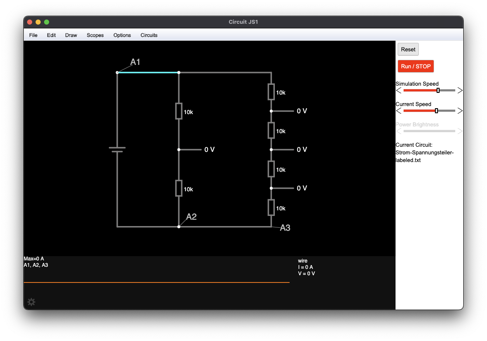
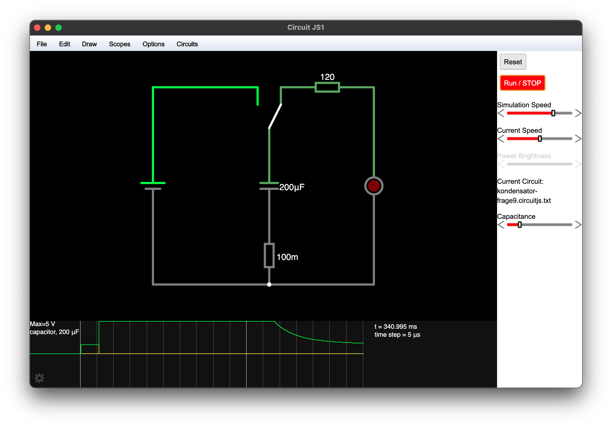
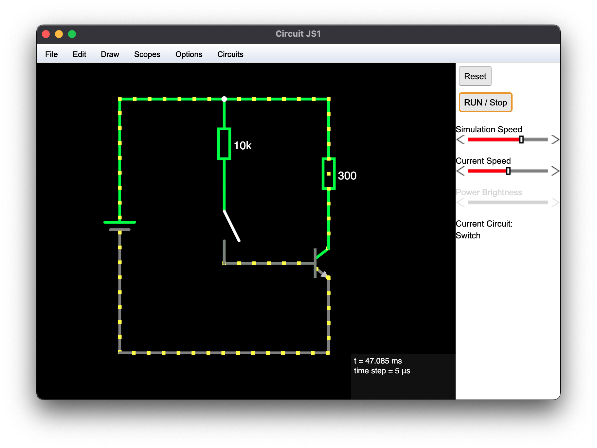
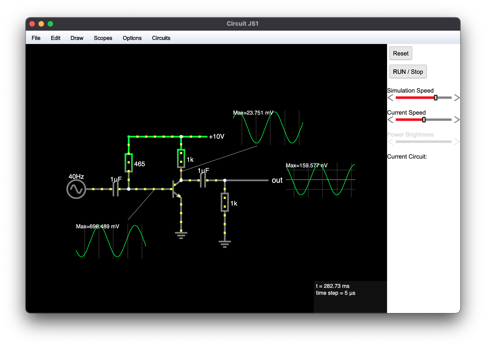
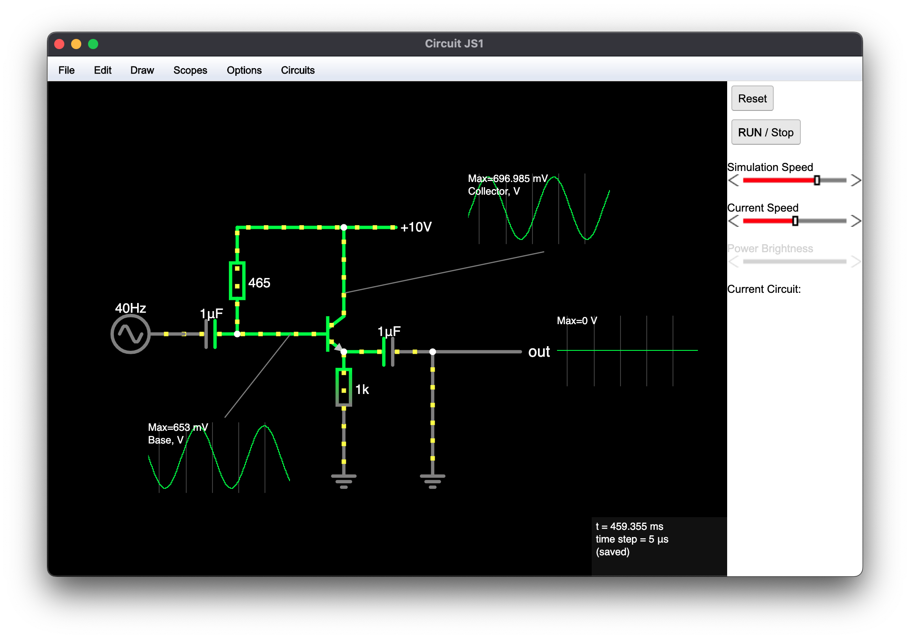
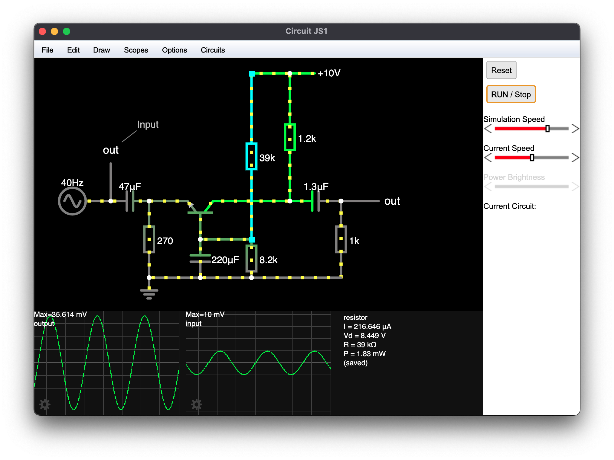
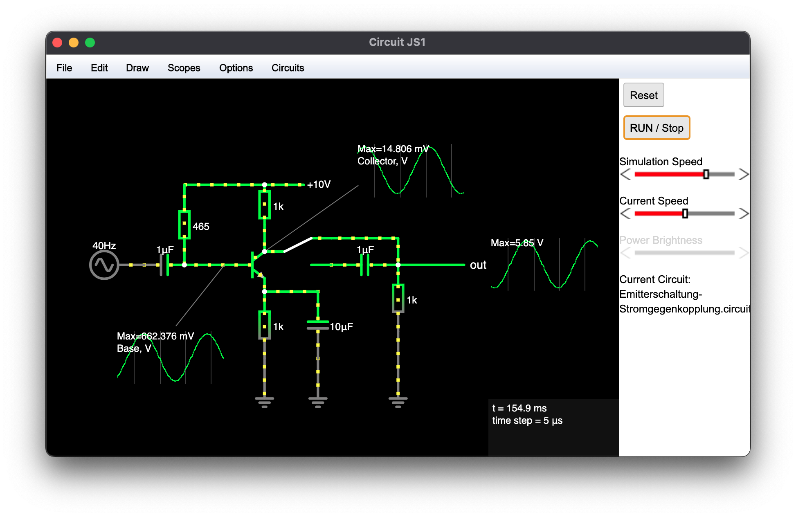
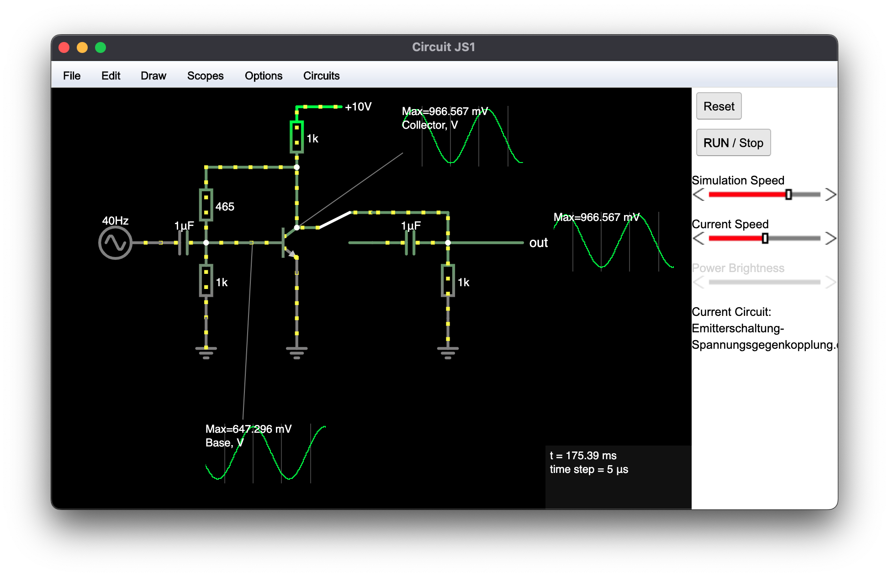
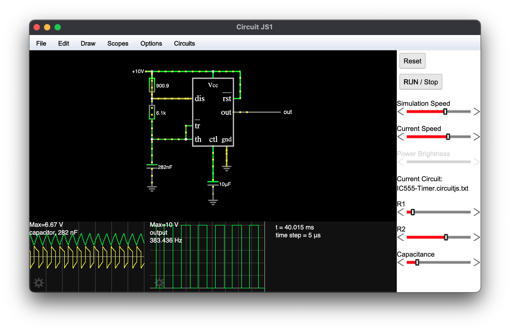

# CriCom Circuit Simulations

Dieses Dokument stellt eine Ergänzung zu den in der Vorlesung vorgestellten Schaltungen dar. Es soll zum besseren Verständnis der Elektrotechnik Grundlagen beitragen und zum Experimentieren mit verschiedensten Schaltungen dienen. 

Dabei bieten wir eine fertige Schaltung an, die in *CircuitJS1* gebaut wurde und möchten mit zwei bis drei Fragen das Verständnis vertiefen. Dabei kann mit den Schaltungen experimentiert werden und Parameter nach Belieben geändert werden. 

Gerne können auch weitere Schaltungen erstellt werden und in einem Github Repository bei SEEMOO hinterlegt werden. Sollte uns Fehler unterlaufen sein können diese unter [kontakt@seemoo.de?]() gemeldet werden. 

- Ein Einstieg in Schaltungen und ET-Gundlagen
- Ergänzung zur Vorlesung, zum selbst ausprobieren, Schaltungen bauen, experimentieren und verstehen
- kennenlernen des Circuit Simulators von Falstad
  - interessantes Tool um Schaltungen jeglicher Art zu bauen und ein besseres Verständnis von Elektrotechnik zu bekommen
- Der [Index](https://www.falstad.com/circuit/e-index.html) von Falstad, bietet viele vorprogrammierte Schaltungen mit Erklärungen
- Kurze Einführungsvideos zu Falstad: 
  - [Einführung und Überblick](https://www.youtube.com/watch?v=0k41Pj8yjSA) 
  - [Verschieden Schaltungen](https://www.youtube.com/watch?v=jv1k34aIIGc) 

## Schaltungen aus Kapitel 2: Grundlagen Elektrotechnik

### Schaltungssimulation: Strom- & Spannungsteiler

Der hier dargestellte Strom- und Spannungsteiler ist von Folie 38 aus Kapitel 02: Grundlagen Elektrotechnik. Die Schaltung findet ihr in: `spannungsteiler.circuitjs.txt`

**Fragen:**

1. Sucht euch die Formel raus und berechnet den Spannungsabfall an jedem Widerstand. 
2. Überprüft eure Berechnung mit der Simulation und probiert gerne noch ein paar Werte aus. 
3. Was stellt Ihr fest, wenn Ihr den Plot betrachtet? Wie viel Ampere ist jeweils an den Punkten A1, A2 und A3? 

### Beispiel: Kondensator

Auf Slide 45 findet ihr ein Beispiel zu Kondensatoren der auf dem Breadboard nachgebaut werden kann. Die Schaltung findet ihr in `kondensator-frage9.circuitjs.txt`

1. Welchen Einfluss hat die Kapazität des Kondensators auf die Leuchtdauer der LED? 

### Spule DC

- slide 55 spule [DC](http://falstad.com/circuit/circuitjs.html?ctz=CQAgjCAMB0l3BWcA2aYDMZIA5nrzgEzYCcICk55lCApgLRhgBQAbiCciOvh18gBYowgTWGUYCZgGUQhBFzACh8-kMoQAZgEMANgGdawwswDufEILmjL65gCcLPLqu68Noh3IVuuoys7CSpBmcgDshLYg-lEh5jFWMYEhut6Kymm+wujg0CSkJCRhuNgIpfiQYQxgkSEA9iBh4MQikIVQsGAkCJjyHfBtYcgKfZSRTejM6NiNIABiEBrgEIwgAJIAdgAmAK4AxgAu2ht7tMxAA) & [AC](http://falstad.com/circuit/circuitjs.html?ctz=CQAgjCAMB0l3BWcAWaAmAzAgbBjB2BSfZBNBADhASVsmoFMBaMMAKADdx9sRzewPEBXr0IyeklFRoCNgCduvESDzLpYEWwDuSvjlUZe-KGwA2h9Zf29RskExiQwATkzECFFwjDPICfFMAe1UQbGQoEAkXF3A7SHJItFCMNgwqDBAAMQg7CARoCBYQAEkAOwATAFcAYwAXAEMymoY2IA) (spule-dc.circuit.txt, spule-dc.circuit.txt)
- Die Schaltung findet Ihr in `spule-dc.circuitjs.txt`

**Fragen:**

1. Wie wirkt sich die Induktivität der Spule auf Spannung und Strom aus, wenn der Schalter links liegt? Also beim "laden" der Spule. 
2. Wie wirkt sich die Induktivität der spule auf Spannung und Strom aus, wenn der Schalter rechts liegt? Also beim "entladen" der Spule.

### Spule AC

Datei: `spule-ac.circuitjs.txt`

**Fragen:**

1. Wie wirkt sich die Induktivität der Spule auf Spannung und Strom aus, wenn der Schalter links liegt? Also beim "laden" der Spule. 
2. Wie wirkt sich die Induktivität der spule auf Spannung und Strom aus, wenn der Schalter rechts liegt? Also beim "entladen" der Spule.

### Kondensator AC

In dieser Schaltung möchten wir herausfinden wie sich der Kondensator bei Wechselspannung verhält. Ladet dazu die Schaltung `kondensator-ac.circuitjs(1).txt`. 

1. Wie wirkt sich die Kapazität des Kondensators bei Wechselspannung auf den Strom aus? 
2. Wie wirkt sich die Kapazität des Kondensators auf die Spannung aus?

## Schaltungen aus Kapitel 3: Elektrotechnik, Filter und Dioden

### Bandsperre

Auf slide 21 findet ihr eine Aufgabe zum Entfernen des 50-Hertz-Netzbrummen. Öffnet die [Schaltung](http://falstad.com/circuit/circuitjs.html?ctz=CQAgjCAMB0l3BWcsDMYBM6EA4GTClgOwBsJIeFFkFApgLRhgBQATiFuStgCwg8k+3PjTCRmAd36CQwkCXRDeUNvMWzlCviQTlR8ZgGNpSvgLMBOPVFjx8HaD0gIBYlCgv5PI2ywA2JvxWgTrWMHYQ4fgoCBboVvGKJHHo2HqSatq6IdniUuby2ZyF6QDmHNmhFeQk2NhQKgBu1Rp8xVWi1FQ0PdAIzAD2HPIi4O5gZtAWeDxEYhZ1RNy1SFH2NOjDKMxAA) `Aufgabe-Bandsperre.circuitjs.txt` und findet mit den Slidern einen möglichen Wert für die Spule und Kondensator, sodass bei *out* nur noch ein minimales Brummen zu vernehmen ist. (Lösung: C = 1.0132mF, L = 10mH)

### Anwendung: Gleichrichtung

Auf Folien 47 und 48 findet ihr ein Anwendungsbeispiel eines [Einweggleichrichtung mit und ohne Ladekondensator](http://falstad.com/circuit/circuitjs.html?ctz=CQAgjCAMB0l3YBMBWEAWZ0DsY1pwMyIBsAHAJyTkjKQ013ICmAtGGAFBjGLql1ZSaEMSy9Bw3gBMmAMwCGAVwA2AFxbKmU8FF0xInAM4ixICSH4ChekAuWGmHAE4nx10b3J5dYeBwDGFnBm1pYgXsJ0+vAQiNCIlJRIgpAE+GDU0ZwA7kF0Ea7h3pAcAOY0WMRFwsiV4XVRHLke1RVVBSW5te3eaPytJQDyfFbCfQIEVY3DLeazk3ocAB7oGCYQ5DwmYyCIwgCiAJYAdtlMpaWah-4AFk7XN6qKx6UAOoYAtoeqAPQA9jdjkx3gAZeQyADWf2OMmOhnkqj+Tg4ADcRiExv0Ojo0IwbDBkBw-hZdsgpugqKRwtByLS6bSsARyN0INEDLpPFAOEA) (`Einweggleichrichtung-mit-ohne-Kondensator.circuitjs.txt`). 

1. Welchen Einfluss hat der Kondensator in der Schaltung? 
2. Was passiert, wenn sich die Kapazität des Kondensators ändert? 

### Filter

Im folgenden sind einige Beispiele und Simulationen von Filtern. Jede Schaltung ist online aufrufbar und kann als text-Datei in CircuitJS geladen werden. 

Man erkennt anhand der Plots gut wie die Input Frequenz im output gefiltert wird. 

#### RC Tiefpass Filter

Bei dem [RC Tiefpass Filter](http://falstad.com/circuit/circuitjs.html?ctz=CQAgjCAMB0l3BWcAWaAOZYDMYEE4xIAmBAdgDZyIFIQka6BTAWjDACgBzEco5EUhh58QaMOShR2AJxDJy-cggm9FyyVhqR2AY2FqVIwf1qo8LNCGapxpLArjkskZFjx4osSBwAecyBJ4RJZOHng4cuCWRJAAVAA2APacAPqEABSkAGoA9IRZAJQAOgDORQCOAH6lzFgAJgBCWex+yN4geKSkAkTdeGimUSAAXtAN0ABcpQBmKZylFaVgOUQADgCWsVjQCADWAPIAFgC2sch4AHYAYgvlpUFoABLD7GCkpgo86pgq6lh0tBicDong4+30Xwk7wMkm0rXwdAQ-3wtAQ3xAIgASgBhUoAFXWjGmqwAhiUSuxEiCsERJG1+jwdkiJDB4BBAdTKTwQDS6ZAGXhoG95N5OqQ+N4KJ42eBwOwgA) erkennt man gut, wie die Spannung sinkt, wenn die Frequenz steigt. Ladet die Schaltung (`rc-tiefpass.circuitjs.txt`) und probiert mit den Werten für Widerstand und Kondensator aus, um bessere Ergebnisse zu erzielen. 

#### RL Tiefpass

Den [RL Tiefpass Filter](http://falstad.com/circuit/circuitjs.html?ctz=CQAgjCAMB0l3BWcAOaAmA7MgnGB-kA2MAFgwTRAUiqpoQFMBaMMAKAA8RDISRlW-bJQF8+YZCDSQAVABsA9gHMA+mEgAKDADUA9Ou0BKADoBHJgGYAJgCFtxgM4BXAHZKGAMwAnACwBObEogGISShAiEwaHcyJI0kJzc1CAkyBbBWClEKVJ8AEoAMkwAKgCWngAOAIYODmx+UWERjVQkfDQScGxySZEIbS397eBQsJBohCRwhJOQCHgYIZEJYBg04X0DPJJDIOnSUvC0MOwA8oMDaZS78WwKtBaUNFPYktjQ2J9fr69TZEgweAQGjXPZ3bh7J4pSCvEDvL4vbAWDAWZEIZDtMaQCA4thAA) findet ihr in `rl-tiefpass.circuitjs.txt`

#### Tiefpassvergleich

Datei: `tiefpassvergleich.circuitjs(1).txt`

Beim [Tiefpassvergleich](http://falstad.com/circuit/circuitjs.html?ctz=CQAgjCAMB0l3BWcBmWBOA7AFjA5AmMSADjGIDYIFIQlraBTAWjDACgAPEfYtcSNBBx8iaLCHH5xAMwD6AcwA6AZ0UBHFdUgAJAF5t5-KSHLGix8gnJQonWuWISC-LEizI33cQCUAwkwAVAEsGaQAHAENlVWUAN2VoFW8AGUCQ8KiY+MTlZP9g0MjotgAnI3FTcXNxBDB8GyJINgAbEEF62vrq2jqbGEhkMmQQJn6PMEHyDAw0MWISfHqmwwQ0esraNZMrPpbt6wxicUPjo77oQcdR2EgEDEWKBCOsDAR8Q6WDEBO2jAOzxqOGhNADGm3WxlWHV6wJu8EuIFQtWQUzQpjA5EEswQ4n6kHYZSw5BqvShPSW-CaAHlweT9nSaOwad1OvxiI5WcC2GCfsRnD9MNYaKgyMwMCMENAppQ+aw0QgrKwoDd2AB3b5nPn1H4-Jrq3nOXjWLW2MpGkAm82ChrwNjqq1-DXia3Ui1oi3Oa0mrlgDA0Ikk+pYOB04b4RnwWjK9i+mjtOlHDm9MMRkNIGAxv30n5kn4pyk0dPQdgAe34iIpwbQjjQ0DQKPlgj9WGIGAgePxNmGSsZ4povhLAFsAEZBAB2DAAJioqQBXAAuYQXyjYZbIFZsVY5ytu4G44EcyDYQA) vergleichen wir drei Tiefpass-Filter. Der linke Plot stellt den Output der drei Filter kombiniert dar, während rechts die Input-Frequenz zu sehen ist. Hier könnt ihr die Werte der verschiedenen Teile einstellen und mit anderen Filtern vergleichen. 

#### LC Bandpass

Datei: `lc-bandpass.circuitjs.txt`

Hier ist eine einfache Version des [LC Bandpass Filters](http://falstad.com/circuit/circuitjs.html?ctz=CQAgjCAMB0l3BWECAstIIEwDZsHZNJ8MAOZSZc5AUwFowwAoAYxBIGZM243O2SKg9BDABOWHhSiwJHOxSzUKKMMYBzXlxIDNIaV0GMANiDyRlAihy08hkCJmiYU2FOzyiMLzKLxRGAB4g+EhmFmKmkH7KziAAMgDCADoAzgBCAIYAdgAmAA4ZKSmMYGaRFjzYCNjcFOwghA3wlDBMAPK6lnpgNoL+APYgynwUKJCiZOKi09NgY+wIeCQu9TDwEBRcw4yDSCND42Rg5tAkizVrcCLgjEA). 

#### RC Hochpass vs. RC Tiefpass

Datei: `rc-tiefpass-vs-hochpass.txt`

Hier ein Vergleich von [RC Hochpass und RC Tiefpass](http://falstad.com/circuit/circuitjs.html?ctz=CQAgjCAMB0l3BWEAmZ0FmQdgCw4QgBz4LZIKQjmUICmAtGGAFADmIOcIhYAbB12KEoUZgCcUCfrykDKM-pTCFIzAMZyQCzT0VRY8CDByowAZj5MAnMh48++uCwAeKHFnCRMVBB7BekHDcUSAAqABsAe1YAfX8ACiwANQB6fySASgAdAGcsgEcAP1z6MwATACEk5ldkPE9SLSxhfwIOYIAvaAroAC5cgDMY1lyC3LAU5AAHAEtQs3QAawB5AAsAW1CcKwA7ADFR-NybQgAJDrZuB10r-iERVQ1eQmFtG+1KGHgvEAXfM14cEIz1IBCwSC+XnEty0shuN0oZjMNV+YCsVGQ0nqpHRQTqIAASgBhegAFRmtAGUwAhjk8jkAG45aC5Yn0U6RNSrGl05hgLCUZCybT86SyMwhTxcCHQFj8+QvWHSfHaCXIJTwKj6FjLTTaHC8IIfUS695wlRKh7MSIgdFmZAiThWYRWaBWd0e92EBDuXgOyE-QW236Eknkyk8+kASR2UwArgAXa3gCD2x2QZ0cN3OlS8JEUFRWXCOJwiCBs8NU2n05aJ+NJm3+X7+gSZ3joBAAks-CAOpsStkcrmR3Ix+vJ7xpyhO4QLbDPbsQJeh9mc7nV3K1hPjoA). 

#### LC Bandsperre 

Datei: `lc-bandsperre.circuitjs.txt`

Hier findet ihr die [LC Bandsperre](http://falstad.com/circuit/circuitjs.html?ctz=CQAgjCAMB0l3BWcMBMcUHYMGZIA4UA2ATmIxAUgpABYqEBTAWjDACgAbEbQvcFPjz4oUNKFGhIYcGmRw8E2UsVkJCUNgGNuvECLFDuacdPjYw5GHkhg8NGmASYwNvHmIS47AE561-QV0wAXEXSDYAeR0+YL4abBQAkzYAc2ijKkNsJ2SLKhR-WL1RJOw9fPhqGHYADz0eEEJ1JXISWj0xABkAYQAdAGcAIQBDADsAE36ABwZvbwY2AHtqBPE6Yj4pWHgyQjUC8USkMoBLUaXuIzXIDeRPHYw9wgOICEWAVwAXNgALcFC2EA). Mit der dargestellten Einstellung greift die Sperre bei ca. 900Hz. 

### Weitere Filter

Falstad selbst bietet einige Schaltungen zu passiven Filtern an. Diese sind unter *Circuits -> Passive Filters* zu finden. Hier hat man die Möglichkeit eine *Cutoff Frequency* einzustellen und sieht wie sich die Werte der Bauteile anpassen. Neben Erklärungen zu Funktion der Schaltung, gibt es einen *Frequency Response Graph* bei dem man den Breakpoint bei 3dB erkennen kann. 

Hier ist eine Liste der interessantesten Filter: 

- [High-Pass Filter (RC)](https://www.falstad.com/circuit/e-filt-hipass.html)
- [High-Pass Filter Response](https://www.falstad.com/circuit/e-filt-hipass-af.html)
- [Low-Pass Filter (RL)](https://www.falstad.com/circuit/e-filt-lopass.html)
- [High-Pass Filter (RL)](https://www.falstad.com/circuit/e-filt-hipass-l.html)
- [Low-Pass Filter (RL)](https://www.falstad.com/circuit/e-filt-lopass-l.html)
- [Band-Pass Filter](https://www.falstad.com/circuit/e-bandpass.html)
- [Notch Filter](https://www.falstad.com/circuit/e-notch.html)

### Dioden

Oben haben wir schon einen Einweggleichrichter gesehen. Hier setzen wir das selbe mithilfe von Dioden um. 

- [Spannungsbegrenzer](http://falstad.com/circuit/circuitjs.html?ctz=CQAgjCAMB0l3BWEDoE4DMAWATKhl0A2AdnVW0gA5lJkbkBTAWjDACgA3cTTEdBbN15geUcCEy0ktGdARsATkOXoiy2mDhsA7nzUjemQsNGRFE48qO9+gjfB0WbAvpWd3H6N3xfZig2yhHPwCXAx8PAGc9QhU1bEkxWgAzAEMAG0iGT3jEkJAEmRzYwtdeUrMAEwL-ArzawMFKhjSAV3SAFzZqr3cyutomltT2roB5J2UBanCigA8C7HQQYmIJF0pact4AZQAHVIA7Q9bDgHNIgCMGM4UGQ4AvBgU2AHsxSy3IVGppaAhaMtAeAPEA) (`spannungsbegrenzer.txt`)
  - Wie funktioniert der Spannungsbegrenzer? 
  - Wie wirkt sich der Widerstand auf die Spannung aus? 
- [Halbwellengleichrichter](http://falstad.com/circuit/circuitjs.html?ctz=CQAgjCAMB0l3BWcBmWBOA7AFjA5AmMSADjGIDYIEkbIQEBTAWjDACgA3cMfEAu1rzTko4EFjpI606AjYAncWBHClI-qPIS2AE25CROFSN46GAMwCGAVwA2AFzYB3fX3x0jb6WwD2mrKISaGj0ULA8UiC8dMi+YlqBkMGhMJARYrwQsUA) (`halbwellengleichrichter.circuitjs.txt`)
  - Wie unterscheiden sich Halbwellen und Vollwellengleichrichter? 
- [Brückengleichrichter](http://falstad.com/circuit/circuitjs.html?ctz=CQAgjCAMB0l3BWcMBMcUHYMGZIA4UA2ATmIxAWwosgoFMBaMMAKADdxDbsEVPbCAFijgQg2klpToCFgHd+IISFzDlkeSshrhq8CjxQWAEy3CwBlYUNhifPsboAzAIYBXADYAXE2ZAoEQisbO38QR1dPH1MUcXBQvQtDB2d3b19Y2ls+PQCglMj0hVzAvx4+DWLtFV5FcqMFTPj7OINDSuDmsTAg7Ib-VrxDQR7-IaMAJ27e0JH88ay4FgAPMUIqWMMEOH8ECGE0EA8AexdjFmORdTFIUmoYSEkw7gv9JWFacTvJWCQIPgsKhYQA) (`brueckengleichrichter.circuitjs.txt`) und [mit Filter](http://falstad.com/circuit/circuitjs.html?ctz=CQAgjCAMB0l3BWcBmWBOA7AFjA5AmMSADjGIDYIEkbIQEBTAWjDACgA3cMfEAu1rzTko4EFjpI606AjYAncWBHClI-qPIS2AE25CROFSN46GAMwCGAVwA2AFzYB3fX3x0jb6WwD2mrKISaGj0ULA8UiC8dMi+YlqBkMGhMJARYrwQsUA)
  - Welchen Vorteil bietet der Gleichrichter mit Filter? 
- Weitere Beispiele an Dioden-Schaltungen findet ihr unter *Circuits -> Diods*

## Schaltungen aus Kapitel 3: Elektrotechnik, Transistoren und Oszillatoren

## Transistoren 

[Hier](https://www.falstad.com/circuit/e-pnp.html) findet Ihr eine Erklärung und Einführung zu PNP Transistoren. 

### Transistoren als Schalter 

- öffne die Schaltung: `Circuits -> Transistors -> Switch`
- [Beispiel von transistor als schalter](https://www.falstad.com/circuit/e-transswitch.html)

### Transistorgrundschaltungen 

#### Emitterschaltung 

[Schaltung](http://falstad.com/circuit/circuitjs.html?ctz=CQAgjCAMB0l3BWcA2aAOMB2ALGXyEw1sESQFJzzKEBTAWjDACgB3EAJgWRAE4eAzAg58ekZgCdO3UdJ5heIytgLMALiAGRs4RZuG6l4KNGSYOmAeaHI0QhA5PJ+2NJgWRMaB25Ec4IAAmtABmAIYArgA2aswAxpyQaIZyKZQw8HAQ9DCYkAjEAt6QCoS8AkqwJcwASonJCiJgyJSNUMbY6bAQ6SZgCLz92LzYWorMAOb6fknTnObt4nVCIvwg+LK9neC9XQjMAPLrFeCYPMINZ4uSc2sr4Ng6rfDxc1g8o01XXZklJpAcKwUJgCZBWOxoQECf7VdhceR6LQ6NriKSfU4fE7w9pgF5TdHYgloZLpNhvR5vb7MTrQ97zERIzSg9ocAD6yGwrM5YA4HF4kFZMGc7gwRUeCmcTEFVRKrMYrLArIAQmEAM60AA0AB1VQA1amQaEqHSuch6JhGNkc9kK3n86UA7DmQ04AROty8QiYB1ZOWKxUAYQA9lEorQ4mogxJtXqDdDSMiKWYZiSQN7rQKeXyBRk4PxzCQOMgzJh3AhMAgfbL5SwgA): `Emitterschaltung.circuitjs.txt`

Ein weiteres Beispiel von Falstad direkt ist der [Common-Emitter Amplifier](https://www.falstad.com/circuit/e-ceamp.html)

1. Was wird bei der [Emitterschaltung](http://falstad.com/circuit/circuitjs.html?ctz=CQAgjCAMB0l3BWcA2aAOMB2ALGXyEw1sESQFJzzKEBTAWjDACgB3EAJgWRAE4eAzAg58ekZgCdO3UdJ5heIytgLMALiAGRs4RZuG6l4KNGSYOmAcmxoB-LPhPJ+Ngr229sHDDo5wQACa0AGYAhgCuADZqzADGnJBohnLJlDDwcBD0MJiQ1mAcdgrYuZ5I6ZAsAEoJSQoiYMiU9VDG2GmwEGkmYAi8vdieWorMAOb6In5JQpPmreI1M7KO-PMg7eDdHQjMAPLrAg2YPMJ1x-OSE7JLeDrN8HFXWDzYh+DnHRmVJpCFmBQcaxoSwCLxEH6VNgpFpaHQtcRSV5HF5vLhiTZwMYHSYyJGcNBJNJQm7YHQ3D7MdoCd48CwiWGaKytDgAfWsLOwLIKHHcLJgziBBNyBEwaGQyDQfNgmRZjC5LIAQqEAM60AA0AB1lQA1SmQakqHQ2ch6JhGVns5Bcjg8yBS34Cf6Jdr5MB2YFWiqVWVgeUAYQA9pFIrRYmoAxJNTq9dTSHDSSAzJNEq1MGzOXbubyvb6cz6ucwgA) verstärkt? Begründe deine Antwort.

#### Kollektorschaltung

[Schaltung](https://www.falstad.com/circuit/circuitjs.html?ctz=CQAgjCAMB0l3BWcA2aAOMB2ALGXyEw1sESQFJzzKEBTAWjDACgB3EAJgWRAE4eAzAg58ekZgCdO3UdJ5heIytgLMALiAGRs4RZuG6l4EPRjaBHbJF4DkYBBTtox0Ah168EWjmgS9s2AIQYHAgACa0AGYAhgCuADZqzADGnJBohnKZlGbwkBD0vND+mM52mMi8WJAIGbksAEppGQoiYMiUrVDGVlCwEDl99lWk-lqKzADm+iIcmCJCCxyD4k2Lsviyg70h3TnQCMwA8iCBs+nkPs17kjPX63NGIXApd8sZZ9f7efl80FoCCqAjq8XzYTx9OAsdhceR6LQ6Lriaafd6nCyaZY3djrfh3LBiZhWATgCqceaabSaWzdDgAfWQ2DpTLAHHckDpMAIWjg2EwHkgAmB9Ny+TpjDpYDpACFogBnWgAGgAOnKAGpEwWnRmnDJ+Nqs2kMpnISVs3gcrn8UFeHDYDhBNAi2BQ8VSqUAYQA9vF4rRkmovRIVerNSTSIiycgKZZBphjZyzezOS6xaKpRKWPaSUISfYkF4DXUiQ7KYi9JYkBxo1BmEA): `Kollektorschaltung.circuitjs.txt`

Ein weiteres Beispiel von Falstad ist der [Emitter Follower or Buffer Amplifier Circuit](https://www.falstad.com/circuit/e-follower.html)

- Was wird bei einer [Kollektorschaltung](http://falstad.com/circuit/circuitjs.html?ctz=CQAgjCAMB0l3BWcA2aAOMB2ALGXyEw1sESQFJzzKEBTAWjDACgB3EAJgWRAE4eAzAg58ekZgCdO3UdJ5heIytgLMALiAGRs4RZuG6l4EPRjaOHLHC7Y0vLZl5RoBDr3cJMYTxkxpwcCAAJrQAZgCGAK4ANmrMAMackP4KIlzyepRm8JAQ9LzQ-AikAry5jpgIvEjZLABKSSl6YMiUqVDG2FmwEFnO3rze2LzYWorMAOb6aZgiQnMcfeIN87L4sn1dAR3dCMwA8iCjacnkHP6L-lmS0423HLMdYPAJ96fHd905uXzQWth+ATYLhoWZ2XqwXJsOSGTTaWHiKYfS5HAQLJbQ1b8W5YMTMLoCcCYHgPObwgQCMScAD6yGw1PpYAsZWpMAIWjgAPckApxI4rMhuWpjGpYGpACFwgBnWgAGgAOlKAGr4nlHOlHfxVERMIz8um00XMyAC5D8XhoBACHDAtHeTAC+BikVigDCAHtotFaPE1O6JArlarCaQdLiQMhHhwtpQHQaTUy3CbskKU86xSxbfpCd4kFadUQoPiOIT-rDo0gOJGi0A) verstärkt?
- Begründe deine Antwort

#### Basisschaltung 

[Schaltung](https://www.falstad.com/circuit/circuitjs.html?ctz=CQAgjCAMB0l3BWcA2aAOMB2ALGXyEw1sESQFJzzKEBTAWjDACgAnEAJgWXAE4PO3TmjRROmSMwDGnSKLD9BPBQMox4kbJhD0YODvkwLkBXtkgBmKLEgsASrPmKwySirERz122LXQwCLwB2GYWkPzMAO5KfAJh2LFQzAAuIBYclAaU6W6KbjoI-mBwIukWImiEvNZotpbxxfAB4HAgAM4ADgCWUgwAJrQAZgCGAK4ANsnMAOYxHCIx8b7SaRmcXjnCon7wHAJg0AgUlZAcvCJYmK7bNizRXDzzoptPSdEvG8TralGrmQvlBKvSTsQHfNJfYEgNAZSQObDpVYgbC1JFqZFudF+BC-CwWZSKBH7PIrImJEIE1TeDRgKyoZC8ZBXBAcTBoa55W5sZGM8m8qGNSTRClbCFAhYg5GI9xkxFuWG-WVxL5y7lgxFgrJiCy8eDMADyPMp5FciR+hoyTgElvA82WAA91hBGpwmS0rAkwAIAJIAOw6oym2A4Vi1xSBe3ARCSAHs+CBkAl5WcdhYEDCMPisLxGSZquo4BA3Mw42tE2JzOdvDrIMguNZneAQF1-YHmEA): `Basisschaltung.circuitjs.txt`

- Was wird bei einer [Basisschaltung](http://falstad.com/circuit/circuitjs.html?ctz=CQAgjCAMB0l3BWcA2aAOMB2ALGXyEw1sESQFJzzKEBTAWjDACgAnEAJgWXAE4PO3TmjRROmSMwDGnSKLD9BPBQMox4kbJhD0YOBAGYumBB2TZeaBLyixILAEqz5isMkoqxEbGtgQ1tmDWQRbYBpD8zADuSnwC4dhxUMwALiBGlBw+6Rweih46CLAS7hxoyMj8GAaiMGj24eYYmLwGCJjI2mBwIADOAA4AllIMACa0AGYAhgCuADYpzADmsWWiXDwJYpIyGZzZe2vbdpAcAmDQCBTE2BYcCuEiier20asiOZkfkjGHB8T7NRvQ4fGqJI6SdhgwHpAEQkBoXKSJxheICbD1HLbEDZbrYmAIYEGZSKVFJHY4oxJCwk1S2DQNECoAhhIhgGrmJhMemvdg06m8Hjw7pwN78o7QiFsSnnUlUqkeJFi+XxAEK6XQ+Vw7KUAy8eDMADyOMFSW4eTpkmNuRcAht4DK22YAA99hARZxOuBIAYcQ6QABJAB2-Rmi2wHF9WQ8mk4Z3ARGSAHs+Ezng6OPr6W1EdVrKRMBJaid-OBmCncmmxD5LNn9cguIFwM3BiGw8wgA) verstärkt? Begründe deine Antwort.

### Basisvorspannung

#### Stromgegenkopplung 

- Wie können wir den Arbeitspunkt stabilisieren? Negatives Feedback stabilisiert

#### Spannungsgegenkopplung 

[Schaltung](http://falstad.com/circuit/circuitjs.html?ctz=CQAgjCAMB0l3BWcA2aAOMB2ALGXyEw1sESQFJzzKEBTAWjDACgB3EAJgWXDA5ADMCfk36RmAJ07de-LjzABOMSGwFmAF0GRs4ZYOF6VEejAFFMHbB0XJc2TAIxRody5kiKEaeR0wIkDjgQABNaADMAQwBXABsNZgBjTkg0I2kFfUoYeDgTGAIEWwJbDw4g5EUXPOYAJRS0pRFkSiaocFVs2AhslzAi-uxFbAFPDmYAcwM5K2ntXWy6uew0-FU03uxW3q6EZgB5cj50lsasqElltKERY+24JNUBEX1CF5Uc3J7YOEU--7+wkwwxGPE+LHY8nSo10bXEUje6URfmM8EmRzklgx83a4nYN1kcywYOYWwEGUExEpumwK3aHAA+nYGdgGXwbJAGQUHDYEJh-GhhMpKlyfpAwAzGGyGQAhSIAZ1oABoADrygBqpMg5LUNLSRVuKkZzOQbPKik5MGK3EsPm8TDGovgEqlEoAwgB7WKxWiJDQeiSqjVa8nIWZgFogfwzBZRpmsznsi2i63IW1cDBgR2fcWSiUsADKRMwPBGIhLuJAUViivpbCezRoxwji3YiJb2LhlyhbShKPaWYe+MMQWuI9m4ms5IJxNUdhAikwFyn2iQSl0vMEwIuUz7WKhMNxzCAA): `Emitterschaltung-Spannungsgegenkopplung.circuitjs.txt`

- Was ist neu bei der Spannungsgegenkopplung? $R_1$ wird am Kollektor angeschlossen statt an $U_0$​ 
- Wie funktioniert die Spannungsgegenkopplung? 
  - Antwort: Negatives Feedback -> Stabilisierung: Wenn IC steigt, steigt UR; Wenn UR steigt, sinkt UCE; Wenn UCE sinkt, sinkt auch UBE; Wenn UBE sinkt, sinkt IC

### Hochfrequenzverstärker

- [Multisim Schaltung von s. 55 ](https://www.multisim.com/content/ni8cHfAF63z7RCYVk4gkuR/hohe-frequenzen/open:) 
- Falstad bietet leider keine "echten Transistoren" an 

- Was passiert bei hohen Frequenzen? 

- Wie können wir das Problem lösen? spezielle RF-Transistoren mit kleinerer Kapazität 

  -> verringert den Effekt parasitärer Kapazitäten

- Welche Option gibt es wenn eine einzelne Verstärkerschaltung nicht aussreicht? 

  -> Hintereinanderschalten von mehreren Verstärkerstufen

### IC555 Timer

Schaltung wie in den Folien: `IC555-Timer.circuitjs.txt`, [555 Timer IC](http://falstad.com/circuit/circuitjs.html?ctz=CQAgjCAMB0l3BWEDYCYDMqDsrUE4AOLSAgsJANgBYQtlJkBTAWjDACgB3cMVEXGmz6oEFKOwDGPYaOkhMDBqmgFULOlRXosVOAXSReVAkhhwOAczkLr6MYvYAlOdRAEGrxSF3gvi6AjsAPLyCHxgFAxUmOCRUOJWqKT8skkE-MkOEUhgeHx4YmkgBSBieNB4lVV48LWo7ABOLoK84EnxNTB4HE1Cbel9uXweYHDQ6Hhc4Hn9crzpkFMiYq59nlODM30C4tzbqIIzO4t7RwfT4TMn8qgMEQzoYbEO3MulNDbr3J8ft7OLiVkjxkYjsC3EUjeBhoUKe-lqEAo0AoKKoWAopBMYX0NDMhiWqUJoMguPYAHtwDd4rpKr4oLBeKZ+JT0OTvLFqaMxKN6bU8OjRCJKRx0Ok6AAxCB3XzwECsECOEXpdKS+IQUay+WOeqiymqhgoWpG41UFgLWAIpDygDCAEMAA62iQASwALraAHYSRjsIA) 

- Verschieden IC555 Timer findet Ihr unter `Circuits-> 555 Chips`
  - zum Beispiel die Internals IC555 Timer Chips 

- Welche Widerstände kann man ändern um die Ausgangsfrequenz zu beeinflussen? 

## Zusatz

### Pong

Hier ein Beispiel was mit Falstad alles möglich ist:Wen es interessiert findet [hier](https://www.falstad.com/pong/index.html) eine Simulation des 1972 von Atari erfundenen Spiels Pong. 
